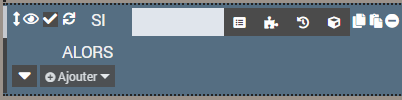
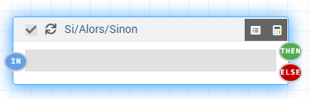
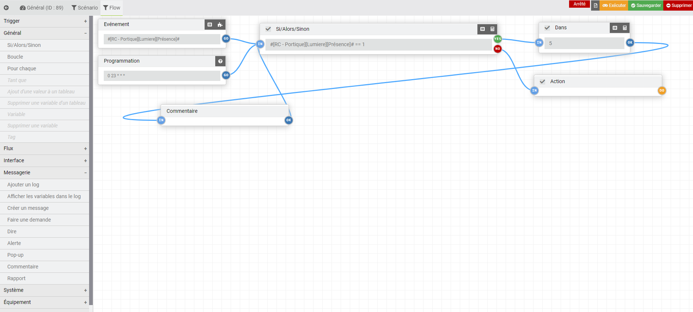

<div id="title">
<a href="../../../{{site.baseurl}}/{{page.pluginId}}/{{page.lang}}">{{page.title}}</a>
</div>

```
 Le plugin est encore jeune et peut encore comporter quelques bugs, mais il évolue régulièrement : n’hésitez pas à me contacter à mon courriel personnel, sois le fobsoft@gmail.com avec toutes vos remarques et suggestions.
```

# Présentation
Plugins pour gérer, créer ou modifier vos scénarios. Utilise les fonctionnalitées du système issus de Jeedom en ajoutant quelque fonctionnalité.
* Une maintenance par nœud
* Ajout de tag
  * #parentLog#: Objet parent du déclencheur du scénario, si le nom des objets son remplacer dans la spécification des équipements ex: [#parentLog#][Lumiere][On], le scénario peut etre utilise pour n'importe quel objet. (A venir)
* Ajout de block
  * Pour chaque: Permet de réaliser une action pour chaque élément d'un tableau. (A venir)
  * Tant que: Permet de réaliser une action tant que la condition est valide. (A venir)
* Ajout d'opérateur
  * arrayIn(valeur, tableau): Permet de déterminer si une valeur est contenue dans l'array (A venir)
  * arrayNotin(valeur, tableau): Permet de déterminer si une valeur n'est pas contenue dans l'array (A venir)
* Ajout de commande
  * Ajout d'une valeur à un tableau: Création/ajout d’une valeur à un tableau (n'existe que pendant l'exécution du scénario.) (A venir)
  * Supprimer une variable d'un tableau: Suppression d’une valeur d’un tableau (A venir)
  * Afficher les variables dans le log: Permet d'afficher dans le log toutes les valeurs associées à l'exécution du scénario (variable, tag, tableau) (A venir)
  * Exécuter un type générique: Permet d'exécuter les commandes des équipements d'un type générique (A venir)
  
# Table des matières
- [Installation et configuration du plugins](#installation-et-configuration-du-plugins)
- [Configuration d'un scénario](#configuration-d'un-scénario) 
  - [Onglet Général](#général) 
  - [Onglet Flow](#flow) 
    - [Souris et touches](#souris-et-touches)
    - [Partie Droite](#partie-droite)
    - [Partie Gauche](#partie-gauche)
- [Exemple](#exemple)
- [A Faire](#a-faire)

## Installation et Configuration du plugins
Dans la section, "Configuration" se trouve quelques options pour configurer l'affichage des logs du plugin.
Une fois le plugin activé, on peut donc passer directement à la création et modification de ceux-ci.

## Configuration d'un scénario
> Attention, il sera possible de convertir vos scénarios issus de Jeedom vers ce plugin, mais l'inverse ne sera pas possible.

Vous pouvez accéder à la fenêtre de maintenance à partir du menu Plugins → Programmation → Advance Scenario.

Sur cette page, vous retrouvez la liste de vos scénarios comme à l'habituelle. Ceux avec un icône vert son des scénarios qui ne sont pas convertis, et ceux de couleur gris sont des scénarios converti.
Une fois converti l'édition d'un scénario via la maintenance de Jeedom n'aura pas d'effet sur celui-ci.
Cliquez sur un scénario pour accéder à sa configuration ou sur "Ajouter" pour en créer un nouveau:


  - ## Général
  Dans cette oonglet vous disposer des meme information que dans un scenario normal mise à par le fait qu'il n'y a pas de section pour les declancheur puisue ceux-ci sont gere directement dans le flow.

  

  - ## Flow

    - ### Souris et touches
      - `Touches Effacer` pour supprimer l'élément une fois le noeud ou la connection sélectionné.
      - `Clic droit` pour afficher l'éditeur du noeud (Appui long pour mobile) (à venir)
      - `Clic gauche appuyez` pour déplacer le nœud sélectionné.
      - `Ctrl + Molette de la souris` Zoom avant/arrière (Pincement pour mobile).

    - ### Partie Droite

      Vous disposez à droite de l'écran des actions habituel d'un scénario, il suffit d'un "drag and drop" vers la droite pour en ajouter. Je ne documenterais pas le fonctionnement de chacune de ces actions, puisqu'il y a déjà une documentation dédiée à ceux-ci.
      Les déclencheurs du scénario se trouvent dans la première boite nommée "Déclencheur".

    - ### Partie Gauche

      - Caractéristiques générales
        - Chaque nœud peut avoir de multiples connections
        - Un premier nœud est ajouté par défaut, celui marque le départ du flow. Ne pas supprimer, puisqu'il est utilisé lorsqu'il n'y a pas d'autre déclencheur ou lorsque vous tester le scénario.
          
      - Option général d'un block
        - Normalement dans une action ou un block d'un scénario nous disposons de certaines options avec ces icônes.  
          - Déplacer l'action, dans notre cas, il ne suffit que de cliquer n'importe où sur le nœud
          - Masquer le block, dans notre cas, il n'y a aucune manière de le masquer
          - Aciver/Désactiver l'action et autoriser ou non la répétition, dans notre cas, ces options se trouve en haut à droite
        - Et dans un block d'un scénario, nous disposons de certaines options avec ces icônes. 
          - Bouton de rechercher, dans notre cas, les options de recherche se trouve en haut à gauche
          - Copier, aucune option de disponible pour le moment
          - Coller, aucune option de disponible pour le moment
          - Supprimer, dans notre cas, cliquer sur le nœud et sur la touche "Effacé" du clavier
          
        Voici un exemple comparatif
        
        

## Exemple


## A faire
* Empécher la suppression du node "Départ" puisque celui-ci est le point d'entré général
* Ajouter un bouton test, pour tester le flow du scénario et ainsi voir son issue

