<div id="title">
<a href="../../../{{site.baseurl}}/{{page.pluginId}}/{{page.lang}}">{{page.title}}</a>
</div>

> Le plugin est encore jeune et peut encore comporter quelques bugs, mais il évolue régulièrement : n’hésitez pas à me contacter à mon courriel personnel, sois le fobsoft@gmail.com avec toutes vos remarques et suggestions.

# Présentation
Plugins pour gérer, créer ou modifier vos scénarios. Utilise les fonctionnalitées du système issus de Jeedom en ajoutant quelque fonctionnalité.
* Une maintenance par nœud
* Ajout de tag
  * En rapport au scénario:
    * #scenarioObject#: Objet parent du scénario, si le nom des objets son remplacer dans la spécification des équipements ex: #tag(scenarioObject,0)[Lumiere][On]#, le scénario peut etre utilise pour n'importe quel objet.
  * En rapport à la commande qui à déclanché le scénario
    * #trigger#: Son nom (ex:)
    * #triggerGenericType#: Son type générique (ex:)
    * #triggerEq#: Le nom de l'équipement (ex:)
  * En rapport à l'exécution du scénario:
    * #triggerObject#: Le nom de l'object parent de la commande, sinon le nom de l'object parent du scénario
* Ajout de block
  * Pour chaque: Permet de réaliser une action pour chaque élément d'un tableau.
  * Tant que: Permet de réaliser une action tant que la condition est valide.
* Ajout d'opérateur
  * arrayIn(valeur, tableau): Permet de déterminer si une valeur est contenue dans l'array
  * arrayNotin(valeur, tableau): Permet de déterminer si une valeur n'est pas contenue dans l'array
* Ajout de commande
  * Ajout d'une valeur à un tableau: Création/ajout d’une valeur à un tableau (n'existe que pendant l'exécution du scénario.)
  * Supprimer une valeur d'un tableau: Suppression d’une valeur d’un tableau
  * Afficher les tags dans le log: Permet d'afficher dans le log toutes les valeurs associées à l'exécution du scénario (tag, tableau)
  * Afficher les variables dans le log: Permet d'afficher dans le log toutes les variavles
  * Exécuter un type générique: Permet d'exécuter les commandes des équipements d'un type générique
  * Rediriger vers: Permet de rediriger le flow vers un noeud
  * Supprimer un noeud programmé
* Modification général:
  * Ajout de boutons supplémentaire pour facilité la gestion des expressions
  
# Installation et Configuration du plugins
Dans la section, "Configuration" se trouve quelques options pour configurer l'affichage des logs du plugin.
Une fois le plugin activé, on peut donc passer directement à la création et modification de ceux-ci.

# Configuration d'un scénario
> Attention, il sera possible de convertir vos scénarios issus de Jeedom vers ce plugin dans une version futur, mais l'inverse ne sera pas possible.

Vous pouvez accéder à la fenêtre de maintenance à partir du menu Plugins → Programmation → Advance Scenario.

Sur cette page, vous retrouvez la liste de vos scénarios comme à l'habituelle. Ceux avec un icône vert son des scénarios qui ne sont pas convertis, et ceux de couleur gris sont des scénarios converti.
Une fois converti l'édition d'un scénario via la maintenance de Jeedom n'aura pas d'effet sur celui-ci.
Cliquez sur un scénario pour accéder à sa configuration ou sur "Ajouter" pour en créer un nouveau:

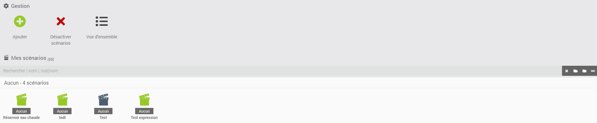

## Général

Dans cette oonglet vous disposer des meme information que dans un scenario normal mise à par le fait qu'il n'y a pas de section pour les declancheur puisue ceux-ci sont gere directement dans le flow.

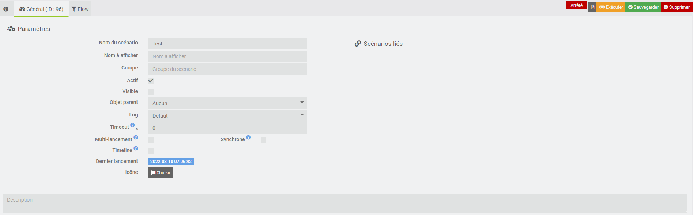

## Flow

- Fonctionnalité
  - `Supprimer un noeud`: Touches "Effacer" du clavier une fois le noeud ou la connection sélectionné.
  - `Supprimer une connection`: Touches "Effacer" du clavier une fois la connection sélectionnée.
  - `Option d'édition d'un noeud`: Clic droit de la sourie sur le noeud pour afficher l'éditeur du noeud (Appui long pour mobile) (à venir)
  - `Déplacer un noeud`: Clic gauche de la sourie appuyez sur le noeud
  - `Zoom avant/arrière`: Ctrl + Molette de la souris (Pincement pour mobile)
  - `Masquer le block`: Dans notre cas, il n'y a aucune manière de le masquer
  - `Autoriser ou non la répétition`: Dans notre cas, cette option se trouve en haut à gauche du titre du noeud
  - `Aciver/Désactiver un noeud`: dans notre cas, cette options se trouve en haut à gauche du titre du noeud sous forme d'un crochet
  - `Bouton de rechercher`: dans notre cas, les options de recherche se trouve en haut à droite du titre
  - `Copier`, aucune option de disponible pour le moment
  - `Coller`, aucune option de disponible pour le moment  
- Caractéristiques générales
  - Chaque nœud peut avoir de multiples connections, si tel est le cas, ceux-ci sont exécutés en parallèle.


- Partie Droite
  
  Vous disposez à droite de l'écran des actions habituel d'un scénario, il suffit d'un "drag and drop" vers la droite pour en ajouter. Je ne documenterais pas le fonctionnement de chacune de ces actions, puisqu'il y a déjà une documentation dédiée à ceux-ci.
  Les déclencheurs du scénario se trouvent dans la première boite nommée "Déclencheur".

  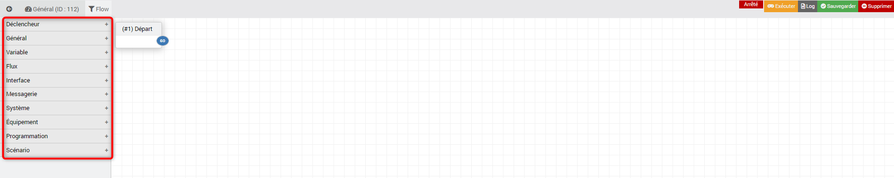

- Partie Gauche
  - Un premier nœud est ajouté par défaut, celui marque le départ du flow. Ne pas supprimer, puisqu'il est utilisé lorsqu'il n'y a pas d'autre déclencheur ou lorsque vous tester le scénario.    
  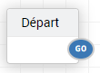
  
  - Nous disposons de certaines options de saisie dans le noeud avec ces icônes. 
  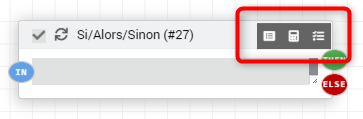

# Exemple d'utilisaion de commande

## Boucle for avec compteur

Comme vous pouvez le constater, vous disposer d'un tag qui est incrémenté à chaque tour dont la syntaxe du nom est "#cntFor[NodeId]#". Le log qui suit l'image n'est que la parti du noeud "Boucle" et de l'exécution des commande sous "DO".

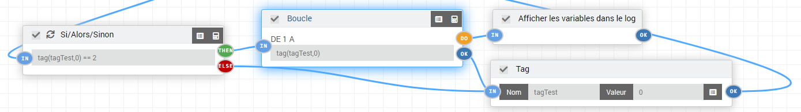

```html
BEGIN for (15)
  BEGIN DO
    BEGIN logTag (19)
      Tag:
       [#cntFor15#] => 1
    END 
  END DO
  BEGIN DO
    BEGIN logTag (19)
      Tag:
       [#cntFor15#] => 2
    END 
  END DO
END 
```

## Ajout de valeur à un tableau
  - arrayAdd (21): Ajout de la valeur 1
  - arrayAdd (23): Ajout des valeurs 3,7,10,100,200 sous la forme d'un Json dont les virgules sont remplacées par des ;
  - arrayAdd (24): Ajout de la valeur de la commande #[RC - Pièce commune][Room config][Max lux for light]#
  - arrayAdd (29): Ajout de la valeur de la variable #pctLight#

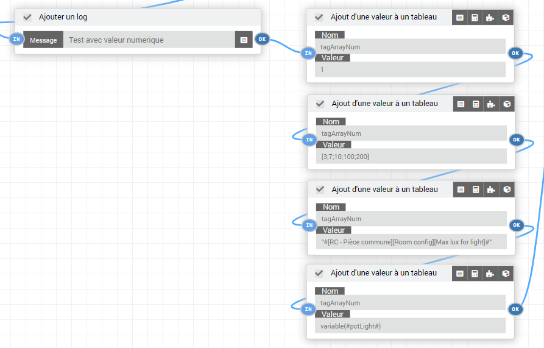

```html
BEGIN log (22)
  Test avec valeur numerique
END 
BEGIN arrayAdd (21)
  Mise à jour du tag tagArrayNum => [1]
END 
BEGIN arrayAdd (23)
  Mise à jour du tag tagArrayNum => [1,3,7,10,100,200]
END 
BEGIN arrayAdd (24)
  Mise à jour du tag tagArrayNum => [1,3,7,10,100,200,30]
END 
BEGIN arrayAdd (29)
  Mise à jour du tag tagArrayNum => [1,3,7,10,100,200,30,95]
END 
BEGIN logTag (28)
  Tag:
   [#tagArrayNum#] => [1,3,7,10,100,200,30,95]
END 
```

## Supression d'une valeur d'un tableau
 - arrayRemove (26): Supression de la valeur 3
 - arrayRemove (27): Supression des valeurs 100,200 sous la forme d'un Json dont les virgules sont remplacées par des ;

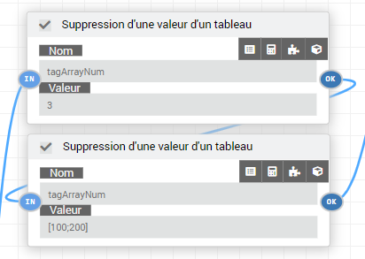

````html
BEGIN arrayRemove (26)
  Mise à jour du tag tagArrayNum => {"0":1,"2":7,"3":10,"4":100,"5":200,"6":30,"7":95,"8":1}
END 
BEGIN arrayRemove (27)
  Mise à jour du tag tagArrayNum => {"0":1,"2":7,"3":10,"6":30,"7":95,"8":1}
END 
````

## Message 

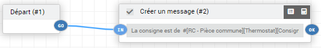
````html
BEGIN message (2)
  Ajout du message suivant dans le centre de message : La consigne est de  21.5
END 
````

## Manipulaion d'un équipement
Voici un exemple de manipultion d'équipement lié à l'obect parent du scénario

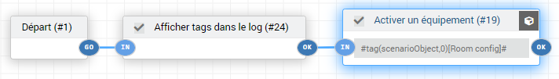
````html
BEGIN Scénario [Aucun][E - Chambre][Test Node] : Scenario lance manuellement
  BEGIN start (1)
    BEGIN logTag (24)
      [#scenarioStartDate#] => 2022-03-25 07:25:13
      [#scenarioId#] => 103
      [#scenarioObject#] => [E - Chambre]
      [#scenarioObjectId#] => 13
      [#trigger#] => user
      [#triggerObject#] => [E - Chambre]
      [#triggerObjectId#] => 13
    END 
    BEGIN equipement_act (19)
      Evaluation de la condition :: #tag(scenarioObject,0)[Room config]#
      Evaluation de la condition :: #[E - Chambre][Room config]#
      Evaluation de la condition :: 814
      Equipement activé : [E - Chambre][Room config]
    END 
  END 
END Fin correcte du scénario
````

## Exécution en parallèle
Pour une exécution en parallèle, il ne suffit que de lier toutes les actions au même noeud plus tôt qu'une disposition bout en bout.

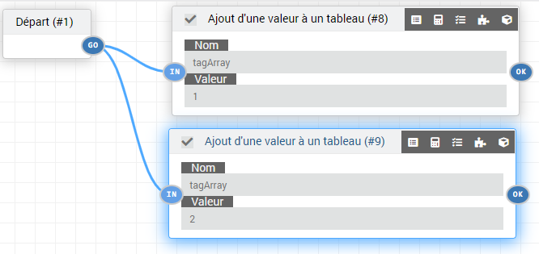

## Déclancheur
Il est possible d'avoir multiple déclancheur et d'avoir un chemin différent pour chacun. Mais comme le scénario ne spécifi pas exactement qu'elle déclancheur à été solicité, le pluggin y va par déduction.

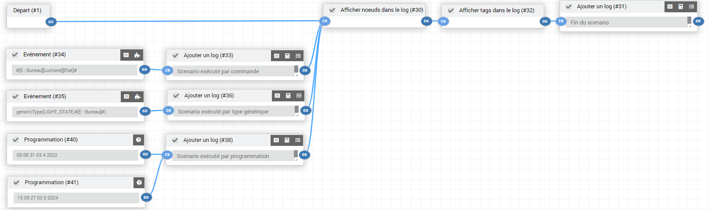
````html
 -- Start : Scenario execute automatiquement sur evenement venant de :  genericType(LIGHT_STATE,#[E - Bureau]#) from [E - Bureau][Lumiere][Etat].
 - Exécution du sous-élément de type [action] : action
 Exécution d'un bloc élément : 554
 - Exécution du sous-élément de type [action] : code
 Exécution d'un bloc code 
   BEGIN Scénario [Aucun][E - Chambre][Test Node] |||#842#
     BEGIN Node (1): {"nodeId":1,"type":"start","subtype":"trigger","options":{},"subelements":{"GO":{"type":"","subtype":"action","expression":"","linkTo":["30"]}},"title":"D\u00e9part"}
       Compare  vs #[E - Bureau][Lumiere][Etat]#
       Compare  vs genericType(LIGHT_STATE,#[E - Bureau]#)
       Compare start == triggerSchedule && [E - Bureau][Lumiere][Etat] == programmation
     END 
     BEGIN Node (34): {"nodeId":34,"type":"triggerEvent","subtype":"trigger","options":{"enable":1},"expression":"#[E - Bureau][Lumiere][Etat]#","subelements":{"GO":{"linkTo":["33"]}},"title":"Ev\u00e9nement"}
       Compare #[E - Bureau][Lumiere][Etat]# vs #[E - Bureau][Lumiere][Etat]#
       Compare #[E - Bureau][Lumiere][Etat]# vs genericType(LIGHT_STATE,#[E - Bureau]#)
       Compare triggerEvent == triggerSchedule && [E - Bureau][Lumiere][Etat] == programmation
     END 
     BEGIN triggerEvent (34)
       BEGIN log (33)
         Scenario exécuté par commande
       END 
       BEGIN logNode (30)
         Node (1): {"nodeId":1,"type":"start","subtype":"trigger","options":{},"subelements":{"GO":{"type":"","subtype":"action","expression":"","linkTo":["30"]}},"title":"D\u00e9part"}
         Node (30): {"nodeId":30,"type":"logNode","subtype":"action","options":{"enable":1},"subelements":{"OK":{"linkTo":["32"]}},"title":"Afficher noeuds dans le log"}
         Node (31): {"nodeId":31,"type":"log","subtype":"action","options":{"enable":1,"value":"Fin du scenario"},"subelements":{"OK":{"linkTo":[]}},"title":"Ajouter un log"}
         Node (32): {"nodeId":32,"type":"logTag","subtype":"action","options":{"enable":1},"subelements":{"OK":{"linkTo":["31"]}},"title":"Afficher tags dans le log"}
         Node (33): {"nodeId":33,"type":"log","subtype":"action","options":{"enable":1,"value":"Scenario ex\u00e9cut\u00e9 par commande"},"subelements":{"OK":{"linkTo":["30"]}},"title":"Ajouter un log"}
         Node (34): {"nodeId":34,"type":"triggerEvent","subtype":"trigger","options":{"enable":1},"expression":"#[E - Bureau][Lumiere][Etat]#","subelements":{"GO":{"linkTo":["33"]}},"title":"Ev\u00e9nement"}
         Node (35): {"nodeId":35,"type":"triggerEvent","subtype":"trigger","options":{"enable":1},"expression":"genericType(LIGHT_STATE,#[E - Bureau]#)","subelements":{"GO":{"linkTo":["36"]}},"title":"Ev\u00e9nement"}
         Node (36): {"nodeId":36,"type":"log","subtype":"action","options":{"enable":1,"value":"Scenario ex\u00e9cut\u00e9 par type g\u00e9n\u00e9rique"},"subelements":{"OK":{"linkTo":["30"]}},"title":"Ajouter un log"}
         Node (38): {"nodeId":38,"type":"log","subtype":"action","options":{"enable":1,"value":"Scenario ex\u00e9cut\u00e9 par programmation"},"subelements":{"OK":{"linkTo":["30"]}},"title":"Ajouter un log"}
         Node (40): {"nodeId":40,"type":"triggerSchedule","subtype":"trigger","options":{"enable":1},"expression":"00 08 31 03 4 2022","subelements":{"GO":{"linkTo":["38"]}},"title":"Programmation"}
         Node (41): {"nodeId":41,"type":"triggerSchedule","subtype":"trigger","options":{"enable":1},"expression":"15 09 27 03 0 2024","subelements":{"GO":{"linkTo":["38"]}},"title":"Programmation"}
       END 
       BEGIN logTag (32)
         [#execByScenarioSys#] => 1
         [#scenarioStartDate#] => 2022-03-31 20:49:56
         [#scenarioId#] => 103
         [#scenarioObject#] => [E - Chambre]
         [#trigger#] => [E - Bureau][Lumiere][Etat]
         [#triggerValue#] => 0
         [#triggerGenericType#] => LIGHT_STATE
         [#triggerEq#] => [E - Bureau][Lumiere]
         [#triggerObject#] => [E - Bureau]
         [#triggerObjectId#] => 12
       END 
       BEGIN log (31)
         Fin du scenario
       END 
     END 
   END Fin correcte du scénario------------------------------------
````
# Exemple de scénario

## Gestion de période
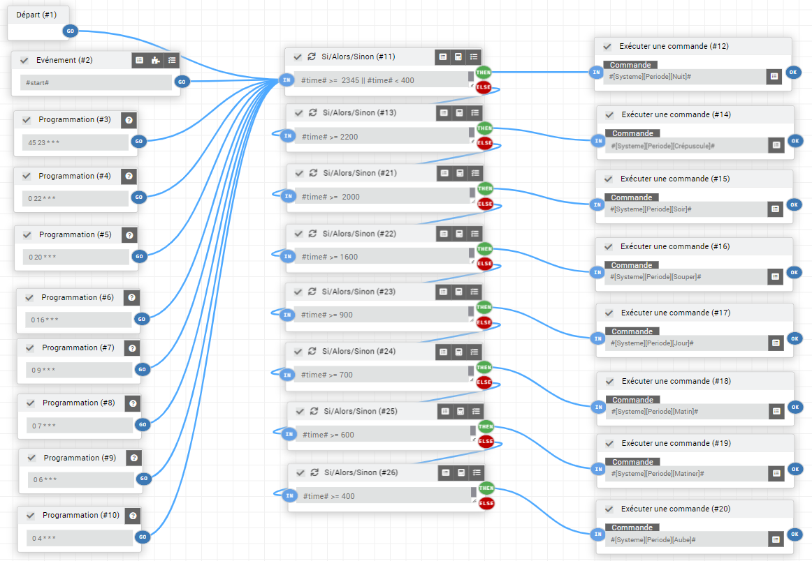

# A Tester

*******************
<table>
  <tbody>
    <tr><td><b>Déclencheur</b></td><td></td></tr>
    <tr><td>&nbsp;&nbsp;Evénement</td><td><b><span style="color:green">Pass</span></b></td></tr>
    <tr><td>&nbsp;&nbsp;Programmation</td><td><b><span style="color:green">Pass</span></b></td></tr>
    <tr><td><b>Général</b></td><td></td></tr>
    <tr><td>&nbsp;&nbsp;Si/Alors/Sinon</td><td><b><span style="color:green">Pass</span></b></td></tr>
    <tr><td>&nbsp;&nbsp;Boucle</td><td><b><span style="color:green">Pass</span></b></td></tr>
    <tr><td>&nbsp;&nbsp;Pour chaque</td><td><b><span style="color:green">Pass</span></b></td></tr>
    <tr><td>&nbsp;&nbsp;Tant que</td><td><b><span style="color:green">Pass</span></b></td></tr>
    <tr><td><b>Variable</b></td><td></td></tr>
    <tr><td>&nbsp;&nbsp;Tag</td><td><b><span style="color:green">Pass</span></b></td></tr>
    <tr><td>&nbsp;&nbsp;Ajout d'une valeur à un tableau</td><td><b><span style="color:green">Pass</span></b></td></tr>
    <tr><td>&nbsp;&nbsp;Supprimer une variable d'un tableau</td><td><b><span style="color:green">Pass</span></b></td></tr>
    <tr><td>&nbsp;&nbsp;Variable</td><td><b><span style="color:green">Pass</span></b></td></tr>
    <tr><td>&nbsp;&nbsp;Rediriger vers</td><td><b><span style="color:green">Pass</span></b></td></tr>
    <tr><td><b>Flux</b></td><td></td></tr>
    <tr><td>&nbsp;&nbsp;Stop</td><td><b><span style="color:green">Pass</span></b></td></tr>
    <tr><td>&nbsp;&nbsp;Attendre</td><td><b><span style="color:green">Pass</span></b></td></tr>
    <tr><td>&nbsp;&nbsp;Pause</td><td><b><span style="color:green">Pass</span></b></td></tr>
    <tr><td>&nbsp;&nbsp;Dans</td><td><b><span style="color:green">Pass</span></b></td></tr>
    <tr><td>&nbsp;&nbsp;A</td><td><b><span style="color:green">Pass</span></b></td></tr>
    <tr><td>&nbsp;&nbsp;Scénario</td><td>À venir</td></tr>
    <tr><td>&nbsp;&nbsp;Retourner un texte/une donnée</td><td><b><span style="color:green">Pass</span></b></td></tr>
    <tr><td>&nbsp;&nbsp;Supprimer tous les bloc programmé</td><td><b><span style="color:green">Pass</span></b></td></tr>
    <tr><td>&nbsp;&nbsp;Supprimer un bloc programmé</td><td>À venir</td></tr>
    <tr><td>&nbsp;&nbsp;Rediriger vers</td><td><b><span style="color:green">Pass</span></b></td></tr>
    <tr><td><b>Interface</b></td><td></td></tr>
    <tr><td>&nbsp;&nbsp;Aller au design</td><td><b><span style="color:green">Pass</span></b></td></tr>
    <tr><td>&nbsp;&nbsp;Icône</td><td><b><span style="color:green">Pass</span></b></td></tr>
    <tr><td>&nbsp;&nbsp;Coloration des icones</td><td><b><span style="color:green">Pass</span></b></td></tr>
    <tr><td><b>Messagerie</b></td><td></td></tr>
    <tr><td>&nbsp;&nbsp;Ajouter un log</td><td><b><span style="color:green">Pass</span></b></td></tr>
    <tr><td>&nbsp;&nbsp;Afficher les tags dans le log</td><td><b><span style="color:green">Pass</span></b></td></tr>
    <tr><td>&nbsp;&nbsp;Afficher les variables dans le log</td><td><b><span style="color:green">Pass</span></b></td></tr>
    <tr><td>&nbsp;&nbsp;Afficher les noeuds dans le log</td><td><b><span style="color:green">Pass</span></b></td></tr>
    <tr><td>&nbsp;&nbsp;Créer un message</td><td><b><span style="color:green">Pass</span></b></td></tr>
    <tr><td>&nbsp;&nbsp;Faire une demande</td><td>À venir</td></tr>
    <tr><td>&nbsp;&nbsp;Dire</td><td>À venir</td></tr>
    <tr><td>&nbsp;&nbsp;Alerte</td><td><b><span style="color:green">Pass</span></b></td></tr>
    <tr><td>&nbsp;&nbsp;Pop-up</td><td><b><span style="color:green">Pass</span></b></td></tr>
    <tr><td>&nbsp;&nbsp;Commentaire</td><td>À venir</td></tr>
    <tr><td>&nbsp;&nbsp;Rapport</td><td>À venir</td></tr>
    <tr><td><b>Système</b></td><td></td></tr>
    <tr><td>&nbsp;&nbsp;Arrêter</td><td><b><span style="color:green">Pass</span></b></td></tr>
    <tr><td>&nbsp;&nbsp;Redémarrer</td><td><b><span style="color:green">Pass</span></b></td></tr>
    <tr><td><b>Équipement</b></td><td></td></tr>
    <tr><td>&nbsp;&nbsp;Activer un équipement</td><td><b><span style="color:green">Pass</span></b></td></tr>
    <tr><td>&nbsp;&nbsp;Désactiver un équipement</td><td><b><span style="color:green">Pass</span></b></td></tr>
    <tr><td>&nbsp;&nbsp;Masquer un équipement</td><td><b><span style="color:green">Pass</span></b></td></tr>
    <tr><td>&nbsp;&nbsp;Afficher un équipement</td><td><b><span style="color:green">Pass</span></b></td></tr>
    <tr><td>&nbsp;&nbsp;Générer un evènement</td><td><b><span style="color:green">Pass</span></b></td></tr>
    <tr><td>&nbsp;&nbsp;Exécuter une commande</td><td><b><span style="color:green">Pass</span></b></td></tr>
    <tr><td>&nbsp;&nbsp;Exécuter un type générique</td><td>À venir</td></tr>
    <tr><td><b>Programmation</b></td><td></td></tr>
    <tr><td>&nbsp;&nbsp;Code</td><td>À venir</td></tr>
  </tbody>
</table>

# A faire
* Général
  * Empécher la suppression du node "Départ" puisque celui-ci est le point d'entré général
* Noeud
  * Aciver/Désactiver un noeud
  * Ajouter une mainenance pour avoir plus d'option pour la création de l'expression du noeud sans trop charger la page principal.
  * Copier/Coller un noeud
  * Ajouter un bouton pour sélectionner les tags disponible
  * Ajouter un bouton pour sélectionner une fonction mathématique
* Commande
  * Boucle: Ajouter la possibilité de sélectionné un type générique
  * Si/Alors/Sinon: Autoriser ou non la répétition des actions si l\'évaluation de la condition est la même que la précédente
  * Switch: Ajouter cette commande pour éviter d'avoir des Si / Sinon bout en bout 
* Log
  * Travailler le visuel du log lors d'exécution en parallèle
* Déclencheurs
  * Ajouter un bouton pour sélectionner un déclancheur
  * Ajouter un bouton pour sélectionner une variable