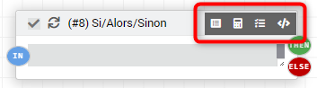

<div id="title">
<a href="../../../{{site.baseurl}}/{{page.pluginId}}/{{page.lang}}">{{page.title}}</a>
</div>

> Le plugin est encore jeune et peut encore comporter quelques bugs, mais il évolue régulièrement : n’hésitez pas à me contacter à mon courriel personnel, sois le fobsoft@gmail.com avec toutes vos remarques et suggestions.

# Présentation
Plugins pour gérer, créer ou modifier vos scénarios. Utilise les fonctionnalitées du système issus de Jeedom en ajoutant quelque fonctionnalité.
* Une maintenance par nœud
* Ajout de tag
  * En rapport au scénario:
    * #scenarioObject#: Objet parent du scénario, si le nom des objets son remplacer dans la spécification des équipements ex: #tag(scenarioObject,0)[Lumiere][On]#, le scénario peut etre utilise pour n'importe quel objet.
  * En rapport à la commande qui à déclanché le scénario
    * #trigger#: Son nom (ex:)
    * #triggerGenericType#: Son type générique (ex:)
    * #triggerEq#: Le nom de l'équipement (ex:)
  * En rapport à l'exécution du scénario:
    * #triggerObject#: Le nom de l'object parent de la commande, sinon le nom de l'object parent du scénario
* Ajout de block
  * Pour chaque: Permet de réaliser une action pour chaque élément d'un tableau.
  * Tant que: Permet de réaliser une action tant que la condition est valide.
* Ajout d'opérateur
  * arrayIn(valeur, tableau): Permet de déterminer si une valeur est contenue dans l'array
  * arrayNotin(valeur, tableau): Permet de déterminer si une valeur n'est pas contenue dans l'array
* Ajout de commande
  * Ajout d'une valeur à un tableau: Création/ajout d’une valeur à un tableau (n'existe que pendant l'exécution du scénario.)
  * Supprimer une valeur d'un tableau: Suppression d’une valeur d’un tableau
  * Afficher les tags dans le log: Permet d'afficher dans le log toutes les valeurs associées à l'exécution du scénario (tag, tableau)
  * Afficher les variables dans le log: Permet d'afficher dans le log toutes les variavles
  * Exécuter un type générique: Permet d'exécuter les commandes des équipements d'un type générique
  * Rediriger vers: Permet de rediriger le flow vers un noeud
  * Supprimer un noeud programmé
* Modification général:
  * Ajout de boutons supplémentaire pour facilité la gestion des expressions
  
# Installation et Configuration du plugins
Dans la section, "Configuration" se trouve quelques options pour configurer l'affichage des logs du plugin.
Une fois le plugin activé, on peut donc passer directement à la création et modification de ceux-ci.

# Configuration d'un scénario
> Attention, il sera possible de convertir vos scénarios issus de Jeedom vers ce plugin dans une version futur, mais l'inverse ne sera pas possible.

Vous pouvez accéder à la fenêtre de maintenance à partir du menu Plugins → Programmation → Advance Scenario.

Sur cette page, vous retrouvez la liste des groupes issus des scénarios de Jeedom et les scénarios créé à partir du plugin sont affichés avec une icône de couleur grise. Lorsqu'il sera possible de convertir vos scénarios issus de Jeedom, ceux-ci apparaîtront avec une icône verte.

Cliquez sur un scénario pour accéder à sa configuration ou sur "Ajouter" pour en créer un nouveau:


## Général

Dans cette onglet vous disposez des meme information que dans un scénario normal mise à part le fait qu'il n'y a pas de section pour les déclencheurs puisque ceux-ci sont géré directement dans le flow.

Dans l’onglet Général, on retrouve les paramètres principaux de notre scénario :
•	Nom du scénario : Le nom de votre scénario.
•	Nom à afficher : Le nom utilisé pour son affichage.
•	Groupe : Permet d’organiser les scénarios, en les classant dans des groupes.
•	Actif : Permet d’activer le scénario.
•	Visible : Permet de rendre visible le scénario.
•	Objet parent : Affectation à un objet parent.
•	Timeout secondes (0 = illimité) : La durée d’exécution maximale autorisée
•	Multi lancement : Cochez cette case si vous souhaitez que le scénario puisse être lancé plusieurs fois en même temps.
•	Mode synchrone : Lance le scénario dans le thread courant au lieu d’un thread dédié. Ca permet d’augmenter la vitesse de lancement du scénario mais cela peut rendre le système instable.
•	Log : Le type de log souhaité pour le scénario. (bypass la config du pluggin - A faire)
•	Suivre dans la timeline : Permet de garder un suivi du scénario dans la timeline.
•	Description : Permet d’écrire un petit texte pour décrire votre scénario.


## Flow
C'est ici que vous allez construire votre scénario. 

- Fonctionnalité
  - `Supprimer un noeud`: Touches "Effacer" du clavier une fois le noeud ou la connection sélectionné.
  - `Supprimer une connection`: Touches "Effacer" du clavier une fois la connection sélectionnée.
  - `Option d'édition d'un noeud`: Clic droit de la sourie sur le noeud pour afficher l'éditeur du noeud (Appui long pour mobile) (à venir)
  - `Déplacer un noeud`: Clic gauche de la sourie appuyez sur le noeud
  - `Zoom avant/arrière`: Ctrl + Molette de la souris (Pincement pour mobile)
  - `Masquer le block`: Dans notre cas, il n'y a aucune manière de le masquer
  - `Autoriser ou non la répétition`: Dans notre cas, cette option se trouve en haut à gauche du titre du noeud
  - `Aciver/Désactiver un noeud`: dans notre cas, cette options se trouve en haut à gauche du titre du noeud sous forme d'un crochet
  - `Bouton de rechercher`: dans notre cas, les options de recherche se trouve en haut à droite du titre
  - `Copier`, aucune option de disponible pour le moment
  - `Coller`, aucune option de disponible pour le moment  
- Caractéristiques générales
  - Chaque nœud peut avoir de multiples connections, si tel est le cas, ceux-ci sont exécutés en parallèle.

- Partie Droite
  
  Vous disposez à droite de l'écran, des déclencheurs dans la première boite nommée "Déclencheur" suivi des actions disponibles, il suffit d'un "drag and drop" vers la droite pour en ajouter. Nous verrons plus loin la documentation de chacun.

  

- Partie Gauche
  - Un premier nœud est ajouté par défaut, celui-ci marque le départ du flow. Ne pas supprimer, puisqu'il est utilisé lorsqu'il n'y a pas d'autre déclencheur ou lorsque vous tester le scénario.    
  
    
  
  - Chacun des nœuds dispose de certaines fonctionnalités
    - La case à cocher, à gauche, permet de désactiver complètement le bloc sans pour autant le supprimer.
    - Les flèches circulaires permettent d’activer ou non la répétition des actions si l’évaluation de la condition donne le même résultat que la précedente évaluation.
    - Les icônes. (encerclé en rouge).
      - Sélection d'une commande : Permet de chercher une commande dans toutes celles disponibles dans Jeedom
      - Sélection d'une variable : Permet de chercher des variables issues du scénario ou d’un autre scénario
      - Sélection d'un mot-clé : Permet de chercher des tags du scénario ou spécifiques à Jeedom
      - Sélection d'une function: Permet de spécifier une valeur à l'aide d'une fonction (a faire)
      - Une maintenance pour construire une expression conditionnelle complexe
  
    

  - Si un nœud est lié à plusieurs nœuds, ceux-ci seront exécutés en parallèle

# Action
  ## Déclencheur (ce qui déclennche le scénario)
    •	Evénement (dans l'ordre de l'affichage des bouttons)
      - Commande de type info
      - Type générique de type info
      - Tag de déclanchement
      - Function de déclanchement
    •	Programmation : pour déterminer le moment d'exécuter le scénario et sa récurrence
  ## Général
    •	Si/Alors/Sinon : Permet de réaliser des actions selon une expression conditionnelle.
    •	Switch : Permet de réaliser des actions en comparent la même variable (ou expression conditionnelle) avec un grand nombre de valeurs différentes, et d'exécuter      différentes actions suivant la valeur à laquelle elle est égale. (À venir)
    •	Boucle : Permet de réaliser des actions de manière répétitive de 1 jusqu’à un nombre défini (ou même la valeur d’un capteur, ou un nombre aléatoire…).
    •	Pour chaque : 
    •	Tant que :
  ## Variable
    •	Tag
    •	Ajout d'une valeur à un tableau
    •	Supprimer une variable d'un tableau
    •	Variable
    •	Supprimer une variable
  ## Flux
    •	Stop
    •	Pause
    •	Dans : Permet de lancer une action dans X minute(s) (0 est une valeur possible). La particularité est que les actions sont lancées en arrière-plan, elles ne bloquent donc pas la suite du scénario. C’est donc un bloc non bloquant.
    •	A : Permet de dire à Jeedom de lancer les actions du bloc à une heure donnée (sous la forme hhmm). Ce bloc est non bloquant. Ex : 0030 pour 00h30, ou 0146 pour 1h46 et 1050 pour 10h50.
    •	Retourner un texte/une donnée
    •	Supprimer tous les noeuds programmé
    •	Supprimer un noeud programmé (a venir)
    •	Rediriger vers
  ## Interface
    •	Aller au design
    •	Icône
    •	Coloration des icones
  ## Messagerie
    •	Ajouter un log
    •	Afficher les tags dans le log
    •	Afficher les variables dans le log
    •	Afficher les noeuds dans le log
    •	Créer un message
    •	Faire une demande
    •	Dire
    •	Alerte
    •	Pop-up
    •	Commentaire : Permet d’ajouter des commentaires à son scénario (À venir)
    •	Rapport (À venir)
  ## Système
    •	Arrêter
    •	Redémarrer
  ## Équipement
    •	Activer un équipement
    •	Désactiver un équipement
    •	Masquer un équipement
    •	Afficher un équipement
    •	Générer un evènement
    •	Exécuter une commande
    •	Exécuter un type générique (À venir)
  ## Programmation
    •	Code : Permet d’écrire directement en code PHP (demande certaines connaissances et peut être risqué mais permet de n’avoir aucune contrainte). (À venir)

# Expression conditionnelle
  ## Opérateurs de comparaison
    •	== : égal à,
    •	> : strictement supérieur à,
    •	>= : supérieur ou égal à,
    •	< : strictement inférieur à,
    •	<= : inférieur ou égal à,
    •	!= : différent de, n’est pas égal à,
    •	& : comparaison binaire
  ## Liens entre les conditions
    •	&& / ET / et / AND / and : et,
    •	| / OU / ou / OR / or : ou,
    •	|^ / XOR / xor : ou exclusif.

# Tag
  Un tag est remplacé lors de l’exécution du scénario par sa valeur
  ## De déclanchement
    •	#start# : déclenché au (re)démarrage de Jeedom
    •	#begin_backup# : événement envoyé au début d’une sauvegarde.
    •	#end_backup# : événement envoyé à la fin d’une sauvegarde.
    •	#begin_update# : événement envoyé au début d’une mise à jour.
    •	#end_update# : événement envoyé à la fin d’une mise à jour.
    •	#begin_restore# : événement envoyé au début d’une restauration.
    •	#end_restore# : événement envoyé à la fin d’une restauration.
    •	#user_connect# : connexion d’un utilisateur
  ## D'information
    •	#seconde# : Seconde courante (sans les zéros initiaux, ex : 6 pour 08:07:06),
    •	#heure# : Heure courante au format 24h (sans les zéros initiaux, ex : 8 pour 08:07:06 ou 17 pour 17:15),
    •	#heure12# : Heure courante au format 12h (sans les zéros initiaux, ex : 8 pour 08:07:06),
    •	#minute# : Minute courante (sans les zéros initiaux, ex : 7 pour 08:07:06),
    •	#jour# : Jour courant (sans les zéros initiaux, ex : 6 pour 06/07/2017),
    •	#mois# : Mois courant (sans les zéros initiaux, ex : 7 pour 06/07/2017),
    •	#annee# : Année courante,
    •	#time# : Heure et minute courante (ex : 1715 pour 17h15),
    •	#timestamp# : Nombre de secondes depuis le 1er janvier 1970,
    •	#date# : Jour et mois. Attention, le premier nombre est le mois. (ex : 1215 pour le 15 décembre),
    •	#semaine# : Numéro de la semaine (ex : 51),
    •	#sjour# : Nom du jour de la semaine (ex : Samedi),
    •	#njour# : Numéro du jour de 0 (dimanche) à 6 (samedi),
    •	#smois# : Nom du mois (ex : Janvier),
    •	#IP# : IP interne de Jeedom,
    •	#hostname# : Nom de la machine Jeedom,
    •	#trigger# : Peut être le nom de la commande qui a déclenché le scénario, ‘api’ si le lancement a été déclenché par l’API, ‘schedule’ si il a été lancé par une programmation, ‘user’ si il a été lancé manuellement
    •	#query# : interaction ayant déclenché le scénario,
    •	#profil# : profil de l’utilisateur ayant déclenché le scénario (peut être vide).
    
# Function 
  ## De déclanchement
    - #variable(nom_variable)# : déclencher un scénario quand une variable est mise à jour (a faire)
  ## D'information
    - matches : contient (ex : [Salle de bain][Hydrometrie][etat] matches “/humide/” ) (a faire)
    - not ( … matches …) : ne contient pas (ex : not([Salle de bain][Hydrometrie][etat] matches “/humide/”)) (a faire)

# Exemple d'utilisaion de commande

## Boucle for avec compteur

Comme vous pouvez le constater, vous disposer d'un tag qui est incrémenté à chaque tour dont la syntaxe du nom est "#cntFor[NodeId]#". Le log qui suit l'image n'est que la parti du noeud "Boucle" et de l'exécution des commande sous "DO".


```html
BEGIN for (15)
  BEGIN DO
    BEGIN logTag (19)
      Tag:
       [#cntFor15#] => 1
    END 
  END DO
  BEGIN DO
    BEGIN logTag (19)
      Tag:
       [#cntFor15#] => 2
    END 
  END DO
END 
```

## Ajout de valeur à un tableau
  - arrayAdd (21): Ajout de la valeur 1
  - arrayAdd (23): Ajout des valeurs 3,7,10,100,200 sous la forme d'un Json dont les virgules sont remplacées par des ";"
  - arrayAdd (24): Ajout de la valeur de la commande #[RC - Pièce commune][Room config][Max lux for light]#
  - arrayAdd (29): Ajout de la valeur de la variable #pctLight#


```html
BEGIN log (22)
  Test avec valeur numerique
END 
BEGIN arrayAdd (21)
  Mise à jour du tag tagArrayNum => [1]
END 
BEGIN arrayAdd (23)
  Mise à jour du tag tagArrayNum => [1,3,7,10,100,200]
END 
BEGIN arrayAdd (24)
  Mise à jour du tag tagArrayNum => [1,3,7,10,100,200,30]
END 
BEGIN arrayAdd (29)
  Mise à jour du tag tagArrayNum => [1,3,7,10,100,200,30,95]
END 
BEGIN logTag (28)
  Tag:
   [#tagArrayNum#] => [1,3,7,10,100,200,30,95]
END 
```

## Supression d'une valeur d'un tableau
 - arrayRemove (26): Supression de la valeur 3
 - arrayRemove (27): Supression des valeurs 100,200 sous la forme d'un Json dont les virgules sont remplacées par des ;


````html
BEGIN arrayRemove (26)
  Mise à jour du tag tagArrayNum => {"0":1,"2":7,"3":10,"4":100,"5":200,"6":30,"7":95,"8":1}
END 
BEGIN arrayRemove (27)
  Mise à jour du tag tagArrayNum => {"0":1,"2":7,"3":10,"6":30,"7":95,"8":1}
END 
````

## Message 


````html
BEGIN message (2)
  Ajout du message suivant dans le centre de message : La consigne est de  21.5
END 
````

## Manipulaion d'un équipement
Voici un exemple de manipultion d'équipement lié à l'obect parent du scénario


````html
BEGIN Scénario [Aucun][E - Chambre][Test Node] : Scenario lance manuellement
  BEGIN start (1)
    BEGIN logTag (24)
      [#scenarioStartDate#] => 2022-03-25 07:25:13
      [#scenarioId#] => 103
      [#scenarioObject#] => [E - Chambre]
      [#scenarioObjectId#] => 13
      [#trigger#] => user
      [#triggerObject#] => [E - Chambre]
      [#triggerObjectId#] => 13
    END 
    BEGIN equipement_act (19)
      Evaluation de la condition :: #tag(scenarioObject,0)[Room config]#
      Evaluation de la condition :: #[E - Chambre][Room config]#
      Evaluation de la condition :: 814
      Equipement activé : [E - Chambre][Room config]
    END 
  END 
END Fin correcte du scénario
````

## Exécution en parallèle
Pour une exécution en parallèle, il ne suffit que de lier toutes les actions au même noeud plus tôt qu'une disposition bout en bout.


## Déclancheur
Il est possible d'avoir multiple déclancheur et d'avoir un chemin différent pour chacun. Mais comme le scénario ne spécifi pas exactement qu'elle déclancheur à été solicité, le pluggin y va par déduction.


````html
 -- Start : Scenario execute automatiquement sur evenement venant de :  genericType(LIGHT_STATE,#[E - Bureau]#) from [E - Bureau][Lumiere][Etat].
 - Exécution du sous-élément de type [action] : action
 Exécution d'un bloc élément : 554
 - Exécution du sous-élément de type [action] : code
 Exécution d'un bloc code 
   BEGIN Scénario [Aucun][E - Chambre][Test Node] |||#842#
     BEGIN Node (1): {"nodeId":1,"type":"start","subtype":"trigger","options":{},"subelements":{"GO":{"type":"","subtype":"action","expression":"","linkTo":["30"]}},"title":"D\u00e9part"}
       Compare  vs #[E - Bureau][Lumiere][Etat]#
       Compare  vs genericType(LIGHT_STATE,#[E - Bureau]#)
       Compare start == triggerSchedule && [E - Bureau][Lumiere][Etat] == programmation
     END 
     BEGIN Node (34): {"nodeId":34,"type":"triggerEvent","subtype":"trigger","options":{"enable":1},"expression":"#[E - Bureau][Lumiere][Etat]#","subelements":{"GO":{"linkTo":["33"]}},"title":"Ev\u00e9nement"}
       Compare #[E - Bureau][Lumiere][Etat]# vs #[E - Bureau][Lumiere][Etat]#
       Compare #[E - Bureau][Lumiere][Etat]# vs genericType(LIGHT_STATE,#[E - Bureau]#)
       Compare triggerEvent == triggerSchedule && [E - Bureau][Lumiere][Etat] == programmation
     END 
     BEGIN triggerEvent (34)
       BEGIN log (33)
         Scenario exécuté par commande
       END 
       BEGIN logNode (30)
         Node (1): {"nodeId":1,"type":"start","subtype":"trigger","options":{},"subelements":{"GO":{"type":"","subtype":"action","expression":"","linkTo":["30"]}},"title":"D\u00e9part"}
         Node (30): {"nodeId":30,"type":"logNode","subtype":"action","options":{"enable":1},"subelements":{"OK":{"linkTo":["32"]}},"title":"Afficher noeuds dans le log"}
         Node (31): {"nodeId":31,"type":"log","subtype":"action","options":{"enable":1,"value":"Fin du scenario"},"subelements":{"OK":{"linkTo":[]}},"title":"Ajouter un log"}
         Node (32): {"nodeId":32,"type":"logTag","subtype":"action","options":{"enable":1},"subelements":{"OK":{"linkTo":["31"]}},"title":"Afficher tags dans le log"}
         Node (33): {"nodeId":33,"type":"log","subtype":"action","options":{"enable":1,"value":"Scenario ex\u00e9cut\u00e9 par commande"},"subelements":{"OK":{"linkTo":["30"]}},"title":"Ajouter un log"}
         Node (34): {"nodeId":34,"type":"triggerEvent","subtype":"trigger","options":{"enable":1},"expression":"#[E - Bureau][Lumiere][Etat]#","subelements":{"GO":{"linkTo":["33"]}},"title":"Ev\u00e9nement"}
         Node (35): {"nodeId":35,"type":"triggerEvent","subtype":"trigger","options":{"enable":1},"expression":"genericType(LIGHT_STATE,#[E - Bureau]#)","subelements":{"GO":{"linkTo":["36"]}},"title":"Ev\u00e9nement"}
         Node (36): {"nodeId":36,"type":"log","subtype":"action","options":{"enable":1,"value":"Scenario ex\u00e9cut\u00e9 par type g\u00e9n\u00e9rique"},"subelements":{"OK":{"linkTo":["30"]}},"title":"Ajouter un log"}
         Node (38): {"nodeId":38,"type":"log","subtype":"action","options":{"enable":1,"value":"Scenario ex\u00e9cut\u00e9 par programmation"},"subelements":{"OK":{"linkTo":["30"]}},"title":"Ajouter un log"}
         Node (40): {"nodeId":40,"type":"triggerSchedule","subtype":"trigger","options":{"enable":1},"expression":"00 08 31 03 4 2022","subelements":{"GO":{"linkTo":["38"]}},"title":"Programmation"}
         Node (41): {"nodeId":41,"type":"triggerSchedule","subtype":"trigger","options":{"enable":1},"expression":"15 09 27 03 0 2024","subelements":{"GO":{"linkTo":["38"]}},"title":"Programmation"}
       END 
       BEGIN logTag (32)
         [#execByScenarioSys#] => 1
         [#scenarioStartDate#] => 2022-03-31 20:49:56
         [#scenarioId#] => 103
         [#scenarioObject#] => [E - Chambre]
         [#trigger#] => [E - Bureau][Lumiere][Etat]
         [#triggerValue#] => 0
         [#triggerGenericType#] => LIGHT_STATE
         [#triggerEq#] => [E - Bureau][Lumiere]
         [#triggerObject#] => [E - Bureau]
         [#triggerObjectId#] => 12
       END 
       BEGIN log (31)
         Fin du scenario
       END 
     END 
   END Fin correcte du scénario------------------------------------
````
# Exemple de scénario

## Gestion de période


# Plugin tier
Il sera possible pour d'autre plugin d'appeler celui-ci avec une liste de nœud à exécuter. Il sera donc possible dans un plugin d'établir un flow d'action prédéterminé mais de permettre à l'utilisateur de modifier celui-ci.

# A faire
* Général
  * Empécher la suppression du node "Départ" puisque celui-ci est le point d'entré général
* Noeud
  * Aciver/Désactiver un noeud
  * Ajouter une mainenance pour avoir plus d'option pour la création de l'expression du noeud sans trop charger la page principal.
  * Copier/Coller un noeud
  * Ajouter un bouton pour sélectionner les tags disponible
  * Ajouter un bouton pour sélectionner une fonction mathématique
* Commande
  * Boucle: Ajouter la possibilité de sélectionné un type générique
  * Si/Alors/Sinon: Autoriser ou non la répétition des actions si l\'évaluation de la condition est la même que la précédente
  * Switch: Ajouter cette commande pour éviter d'avoir des Si / Sinon bout en bout 
* Log
  * Travailler le visuel du log lors d'exécution en parallèle
* Déclencheurs
  * Ajouter un bouton pour sélectionner un déclancheur
  * Ajouter un bouton pour sélectionner une variable