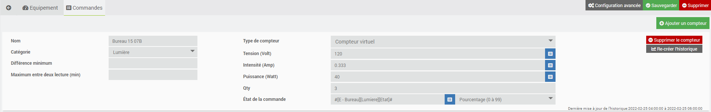

<a href="../../../{{site.baseurl}}/{{page.pluginId}}/{{page.lang}}">{{page.title}}</a>

> Le plugin est encore jeune et peut encore comporter quelques bugs, mais il évolue régulièrement : n’hésitez pas à me contacter à mon courriel personnel, sois le fobsoft@gmail.com avec toutes vos remarques et suggestions.

# Préambule
Je vais me servir de ma propre architecture d'équipement dans les exemples qui vont suivre, donc en voici la structure :

* J'ai d'abord un équipement qui me rapporte ma consommation électrique calculée par mon fournisseur qui me servira de référence et donc qui ne dois pas être pris en compte dans les calculs.
* Un panneau de 200 ampères alimenté par mon fournisseur nommé (Panneau 1), et sous ce panneau
  * 4 circuits de consommation connue
  * 1 circuits de consommation inconnue
  * Un panneau de 60 ampères nommé (Panneau génératrice), et sous ce panneau
    * 6 circuits de consommation inconnue dont je contrôle les lumières via la domotique
* Un deuxième panneau de 200 ampères alimenté par mon fournisseur nommé (Panneau 2), et sous ce panneau
  * 15 circuits de consommation connue
  * 10 circuits de consommation inconnue
  * Un panneau de 100 ampères nommé (Panneau SS), et sous ce panneau
    * 24 Circuits de consommation inconnue dont je contrôle les lumières via la domotique

Évidemment, je ne calcule pas chacun de ces circuits, mais par déduction parce que je sais quand un équipement est activé ou en soustrayant la consommation d'un équipement à une consommation générique, on peut en connaître une estimation.
Ainsi, si je connais la consommation d'un circuit et que j'en contrôle l'activation des lumières, je peux donc déduire la consommation des prises électriques.
Ou si je connais la consommation générale d'un panneau et celle de certains circuits, je peux estimer la consommation des autres circuits

# Présentation
Plugin permettant de récupérer les informations de consommation électrique et de les interpréter sous forme de graphique. Il est possible avec celui-ci, d'avoir un total de consommation et de déduire d'en déduire des consommations pour avoir un total restant.

# Installation et Configuration du plugins
Dans la section, "Configuration" se trouve quelques onglets.
* Paramètres généraux : on renseigne ici la température intérieure et extérieur, il en résultera dans le graphique une courbe démontrant la différence entre ces deux valeurs.
* Électricité : valeur de tarification et code de couleur pour le graphique par catégories
* Log : options pour configurer l'affichage des logs du plugin

Dans la section "Fonctionnalités", vous pouvez constater une cron, elle sert à créer l'historique de consommation à l'aide de celle de l'équipement. Il est donc possible si vous équipements ont de l'historique de la récupérer.

Une fois le plugin activé, on peut donc passer directement à la création d'un équipement.

# Configuration des équipements
Les équipements sont accessibles à partir du menu Plugins → Energie → Energy Meter.

Sur cette page vous retrouvez la liste de vos équipements. Cliquez sur un équipement pour accéder à sa configuration ou sur "Ajouter" pour en créer un nouveau:

Le plugin va créer un total de consommation pour chaque équipement, donc par exemple, je calcule la consommation du circuit qui alimente le panneau génératrice, dans celui-ci, je calcule par déduction la consommation des lumières qu'ils alimentent puisque c'est la domotique qui les contrôles. J'arrive donc à connaître par déduction la consommation des autres circuits du panneau génératrice.

## Équipement
  * Onglet équipement
    * Paramètres généraux
      * Nom de l'équipement : nom de votre équipement.
      * Objet parent : indique l’objet parent auquel appartient l’équipement.
      * Équipement parent : indique que le total de consommation de l'équipement en cour fait parti de la consommation de l'équipement spécifié 
      * Catégorie : indique la ou les catégories auxquelles l’équipement fait référence.
      * Activer : permet de rendre l’équipement actif.
      * Visible : permet de rendre l’équipement visible sur le dashboard. (pas présent pour le moment, j'attend vos suggestion de rendu pour le widgets)
      * Type : permet de spécifier le type de consommation, pour l'instant il n'y a qu'un type, mais je suis ouvert si quelqu'un à d'autres besoin.

    

  * Onglet commandes
    * Nom : renseignez le nom de votre compteur.
    * Catégorie : la catégorie à laquelle cette consommation sera associée
      * Équipement : différentes catégories d'équipement
      * Générique :
        * Référence : affichée à titre d'information, elle apparaît comme une courbe et n'influence pas les calcules.
        * Total à imputer : cette valeur sera imputée des consommations calculées des équipements liés à celle-ci via "Équipement parent" 
    * Différence minimum : lors de la création de l'historique, c'est le minimum requis pour une nouvelle entré dans celle-ci. Cela nous sert de purge pour ne pas avoir trop de données inutilement sans pour autant perdre les données originales.
    * Maximum entre deux lectures : dans le cas où le maximum serait atteint le plugin en conclura que la consommation est à 0 après ce temps.
    * Type de compteur : détermine la méthode de calcul.
      * Compteur physique simple
        * Consommation : commande qui nous renseigne la consommation en Kwh ou en wh
        * Formule de calcul : si on veut appliquer une variation à la valeur
      * Compteur physique double (dans le cas où nous aurions deux lectures de consommation, ces deux lectures seront additionnées.)
        * Consommation : commande qui nous renseigne la première consommation en Kwh ou en wh
        * Consommation 2 : commande qui nous renseigne la deuxième consommation en Kwh ou en wh
        * Formule de calcul : si on veut appliquer une variation à la valeur
      * Compteur virtuel (Dans le cas où nous contrôlons l'alimentation de l'équipement sans en connaître sa consommation. On doit connaître l'une des trois valeurs pour calculer la consommation, soit la tension, l'intensité ou les volts. La troisième sera calculée automatiquement.)
        * Tension (Volt): Commande qui nous renseigne cette valeur
        * Intensité (Amp): Commande qui nous renseigne cette valeur
        * Puissance (Watt): Commande qui nous renseigne cette valeur
        * Qty : nombre d'équipement alimenté (utile par exemple, si un interrupteur alimente plusieurs lumières)
        * État de la commande : Commande qui nous renseigne sur l'état de l'alimentation
      * Consommation virtuel (Dans le cas où nous contrôlons l'alimentation d'un équipement et que l'on connaît sa consommation et que celle-ci est toujours la même)
        * Consommation : commande qui nous renseigne la consommation en Kwh ou en wh
        * État de la commande : Commande qui nous renseigne sur l'état de l'alimentation
    * Un bouton pour supprimer le compteur
    * Un bouton pour recréer l'historique
    * Et en bas à droite la dernière période prit en compte par le calcul de l'historique, si vous venez de créer l'équipement ou de faire la demande de recréer l'historique, il est normal que celle-ci ne soit pas à jour. À chaque 5 minute le plugin devrai gérer une nouvelle période d'historique.
      
## Exemple
  * Voici l'architecture parent enfant créé à partir du champ "Équipement parent" sous l'onglet "Paramètres généraux" 

  

  * Voici ma configuration pour mon équipement qui me rapporte ma consommation électrique calculée par mon fournisseur qui me sert de référence et donc qui n'est pas pris en compte dans les calculs, j'ai mit en évidence la ligne noir qui sert de référence.

  
  

  * Voici ma configuration pour l'arborescence d'un des panneaux

  Panneau 1
  
  Panneau Génératrice
  
  
  
  Vous remarquerez que dans le graphique, il n'est pas fait mention du "Panneau Génératrice" mais bien du "Sous-total Panneau Génératrice" puisque l'on a soustrait la consommation de "Bureau 15 07B"
  

  Vous remarquerez que si vous afficher un équippement qui contient des enfants, comme dans notre cas présent le "Panneau 1", une ligne noir dans le graphique représente la lecture total de l'équipement comme référence en plus du sous-totaux restant de celui-ci
  

  
# FAQ
Pour toute question, suggestion ou problème, écrivez-moi au fobsoft@gmail.com 

# Changelog
[Lien vers le changelog](./changelog.md)

  
  
  