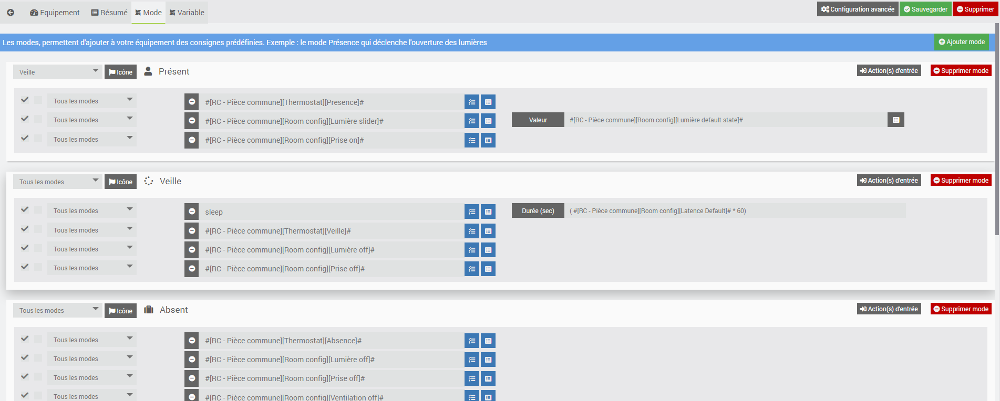
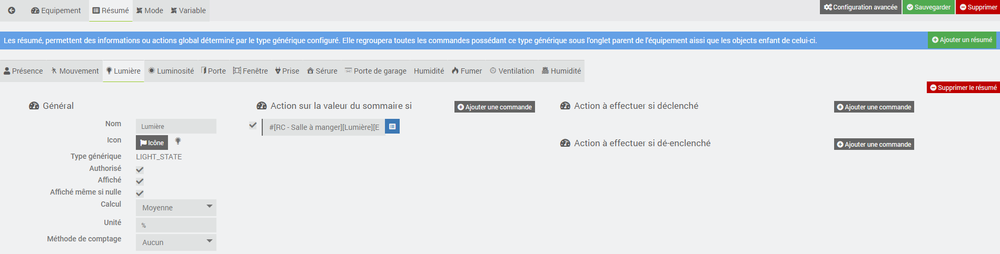

<a href="../../../{{site.baseurl}}/{{page.pluginId}}/{{page.lang}}">Plugin {{page.pluginId}}</a>

# Présentation
> Le plugin est encore jeune et peut encore comporter quelques bugs, mais il évolue régulièrement : n’hésitez pas à me contacter à mon courriel personnel, sois le fobsoft@gmail.com avec toutes vos remarques et suggestions.

Plugins pour gérer vos commandes via leur type générique de manière dynamique. Il se présente de la même manière que les sommaires des objets à la différence que les commandes sont ajouté automatique à l'équipement si celle-ci fait partie de son objet parent ou de l'un de ces enfants. Une fois fait, il vous donnera ces possibilités :
* Créer une commande d'information qui regroupe toutes les commande d'un type générique.
* Créer une commande d'action qui regroupe toutes les commande d'un type générique, par exemple, déverrouiller toutes les serrures extérieures.
* Ajouter des modes à l'équipement avec des actions à exécuter
* Ajouter des actions aux changements d'une commande d'information.
* Ajouter de variables pour prédéterminer certaines valeurs.

À venir dans les prochaines versions
* Ajouter des conditions à l'exécution d'une commande d'action.
* Ajouter des exécutions de commande programmé.

Ainsi en utilisant ce plugins pour gérer une pièce par exemple, il sera possible lors: 
* D'une détection de présence via une commande d'information d'exécuter l'action de passer au mode présent de l'équipement
* Celui-ci exécutera l'ouverture des lumières à un pourcentage prédéterminée (variable) à la condition que la luminosité soit plus petite qu'une valeur prédéterminée (variable).

Voici une partie de l'arborescence de mes objets auxquels je ferai référence lors de mes exemples.

# Installation et Configuration du plugins
Pour l'instant, le plugin ne requière pas d'information générique pour son fonctionnement. Par contre comme vous pouvez le constater deux crons peuvent être activé, elles servent à faire l'ajoute de nouvelle commande à l'équipement de manière dynamique. Donc si vous ne prévoyez pas l'ajout de plusieurs équipements, vous pouvez désactiver celle qui roule aux cinq minutes. Une fois le plugin activé, on peut donc passer directement à la création d'un équipement.

# Configuration des équipements
Les équipements sont accessibles à partir du menu Plugins → Programmation → Generic Type Manager.

Sur cette page vous retrouvez la liste de vos équipements. Cliquez sur un équipement pour accéder à sa configuration ou sur "Ajouter" pour en créer un nouveau:

## Équipement
* Nom de l'équipement : nom de votre équipement.
* Objet parent : indique l’objet parent auquel appartient l’équipement.
* Activer : permet de rendre l’équipement actif.
* Visible : permet de rendre l’équipement visible sur le dashboard.

## Résumé

Les résumés, permettent de regrouper des informations ou actions d'un type générique. Toutes les commandes possédant ce type générique sous l'onglet parent de l'équipement ainsi que les objets enfant de celui-ci seront automatiquement prit en considération.

Lors de l'ajout d'un résumé, il vous sera demandé deux choses, le nom que vous voulez donner au résumé qui doit être unique pour l'équipement et le type générique désiré. Si vous voulez créer un résumé dont les commande ne figure pas dans l'objet parent de l'équipement ou l'un de ces enfants, vous pouvez simplement inscrire "NONE" ainsi le plugin ne cherchera pas à associer de manier automatique des commandes à se résumer, se sera à vous de le faire manuellement.
* Général
  * Nom : nom du résumé
  * Icon : icône qui sera utilisé pour l'affichage du résumé sur le dashbord
  * Type générique : le type générique des commande qui doivent être inclus au résumé
  * Authorisé : permet de rendre le résumé actif, dans le cas contraire, les valeurs de celui-ci seront remonté, mais les actions associées à celui-ci ne seront pas exécuté.
  * Affiché : permet de rendre visible le résumé sur le dashbord
  * Affiché même si nulle : permet de rendre visible le résumé sur le dashbord même si aucune valeur n'est remontée
  * Calcul : le type de calcul qui doit être effectué lors d'un changement de valeur d'une commande
  * Unité : Unité de la mesure
  * Méthode de comptage : Méthode de comptage, si binaire est sélectionné, le résumé agit comme un interrupteur (on , off)
* Action sur la valeur du sommaire si
  * Commande : liste des commandes qui affecte le résumé
  * Activer : permet de rendre la commande active, dans le cas contraire, elle n'affectera pas le résumé.
* Action à effectuer si déclenché
  * Commande : liste des commandes à déclencher
  * Activer : permet de rendre la commande active, dans le cas contraire, elle ne sera pas déclenché.
* Action à effectuer si dé-enclenché
  * Commande : liste des commandes à déclencher
  * Activer : permet de rendre la commande active, dans le cas contraire, elle ne sera pas déclenché.

> Pour des exemples d'application de différents types générique, voir "Exemple de différents types générique".
> Comme mon installation domotique évolue et que ce plugin va disposer prochainement d'une option pour le dupliquer ainsi qu'une option pour appliquer sa configuration sur un autre équipement, j'ajoute à l'équipement tous les sommaires dont je pense avoir besoin dans l'une ou l'autre de mes pièces ce qui me donne ceci au final.

## Mode
Les modes sont des consignes prédéterminées à exécuter à l'exécution de celui-ci. Par exemple, dans l’image ci-dessous, le mode "Présent" qui lors de son exécution exécute la consigne d'activer le type générique relié à l'ouverture des lumières et des prises et de changer le mode de mon thermostat, il détermine en fait le comportement que l'équipement doit avoir lorsque je suis présent dans la pièce. Ici, rien n’est figé, je peux définir autant de modes que je le souhaite pour les utiliser via des scénarios par exemple.
Vous pouvez, pour une meilleure visualisation, configurer une icône à celui-ci.

## Variable
Les variables, permettent de sauvegarder des valeurs qui pourront être utilisé ou modifié par la suite dans un scénario ou un mode. Par exemple, dans l'exemple illustré, j'utilise "Light Default Power" pour configurer la puissance de smes lumiere lors de leur ouverture et celle-ci est modifier selon la période de la journée.

Une fois configurées, elles peuvent être visualisées sur le dashbord en cliquant sur le "I" en haut à droite de la tuile.

# Exemple

## Exemple de différent type générique
Voici la configuration des équipements qui s'applique à toutes mes pièces internes qui me servent à les contrôler, dans ce cas, la pièce "RC - Pièce commune" qui est une pièce a aire ouverte incluant trois pièces distincte "RC - Sallon, RC - Salle à manger et RC - Cuisine". Ces trois pièces disposent de capteur de mouvements, luminosité et ouverture de porte et d'actionneur de lumières.

## NONE
Pour être en mesure de mettre mes pièces en mode "Veille" ou "Absence", je calcule le maximum de deux valeurs que possède chacun des profils de la maison soit (Present ou Proximité). Donc si une seule de ces valeurs binaire est à un, le sommaire résultat de résumé sera à 1. Mais comme ces commandes ne sont pas dans l'objet parent de l'équipement ou l'un de ces enfants, j'ai ajouté chacune des commandes manuellement. 

Sur le dashbord l'équipement a donc cette apparence et vous pouvez voir l'icône configurée dans le sommaire du résumé au niveau de la bande supérieure de la tuile de l'équipement puisqu'il s'agit d'une information sans possibilitée d'action. 

## Type générique sans actionneur
Un type générique sans actionneur est un type générique associé à des commandes qui n'ont aucune commande d'action relié à celle-ci.

Pour être en mesure de mettre mes pièces en mode "Présent", j'ajoute un sommaire qui regroupe mes capteurs de présence. Donc je choisis comme type générique "Présence", je spécifie les bonnes informations générales et je sauvegarde mes modifications. Normalement, une fois, ceci fait vous devriez voir apparaître dans "Action sur la valeur du sommaire si" les commandes contenue sous l'objet parent ou l'un de ces enfants qui ont ce type générique. 

Sur le dashbord l'équipement à donc maintenant cette apparence et vous pouvez voir l'icône configurée dans le sommaire du résumé au niveau de la bande supérieure de la tuile de l'équipement puisqu'il s'agit d'une information. 

## Type générique avec actionneur
Un type générique avec actionneur est un type générique associé à des commandes qui ont des commandes d'action relié à celle-ci.

Pour être en mesure d'ouvrir les lumières de ma pièce, j'ajoute donc un sommaire qui regroupe les commande me donnant l'état de mes lumière. Donc je choisis comme type générique "Lumière état", je spécifie les bonnes informations générales et je sauvegarde mes modifications. Normalement, une fois, ceci fait vous devriez voir apparaître dans "Action sur la valeur du sommaire si" les commandes contenue sous l'objet parent ou l'un de ces enfants qui ont ce type générique. 

Sur le dashbord l'équipement a donc maintenant cette apparence et vous pouvez voir l'icône configurée dans le sommaire du résumé au niveau de la bande inférieur de la tuile de l'équipement puisqu'il s'agit d'une action.
De plus vous disposer dans l'équipement d'une commande pour configurer la valeur par défaut lors de l'activation de l'équipement

# FAQ
Pour toute question ou problème, écrivez-moi au fobsoft@gmail.com 

# Changelog
[Lien vers le changelog](./changelog.md)
