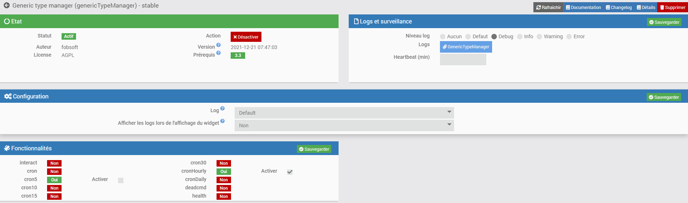
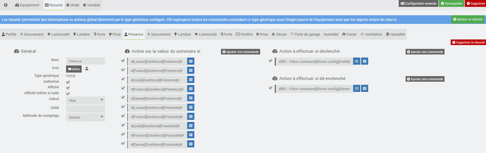

<a href="../../../{{site.baseurl}}/{{page.pluginId}}/{{page.lang}}">Plugin {{page.pluginId}}</a>

# Présentation

> Le plugin est encore jeune et peut encore comporter quelques bugs, mais il évolue régulièrement : n’hésitez pas à me contacter à mon courriel personnel, sois le fobsoft@gmail.com avec toutes vos remarques et suggestions.

Plugins pour gérer vos commandes via leur type générique de manière dynamique. Il se présente de la même manière que les sommaires des objets à la différence que les commandes sont ajouté automatique à l'équipement si celle-ci fait partie de son objet parent ou de l'un de ces enfants. Une fois fait, il vous donnera ces possibilités :
* Créer une commande d'information qui regroupe toutes les commande d'un type générique.
* Créer une commande d'action qui regroupe toutes les commande d'un type générique, par exemple, déverrouiller toutes les serrures extérieures.

À venir dans les prochaines versions
* Ajouter des modes à l'équipement avec des actions à exécuter
* Ajouter des actions et conditions aux changements d'une valeur d'une commande d'information.
* Ajouter des variables qui pourrons être relie aux conditions d'exécution d'une action.
* Ajouter des exécutions de commande programmé

Ainsi en utilisant ce plugins pour gérer une pièce par exemple, il sera possible lors d'une détection de présence de passer au mode présent de l'équipement et d'exécuter l'ouverture des lumières à la condition que la luminosité soit plus petite qu'une valeur prédéterminée.

Voici une partie de l'arborescence de mes objets auxquels je ferez référence lors de mes exemples.

Installation et Configuration du plugins
========================================
Pour l'instant, le plugin ne requière pas d'information générique pour son fonctionnement. Par contre comme vous pouvez le constater deux crons peuvent être activé, elles servent à faire l'ajoute de nouvelle commande à l'équipement. Donc si vous ne prévoyez pas l'ajout de plusieurs équipements, vous pouvez désactiver celle qui roule aux cinq minutes. Une fois le plugin activé, on peut donc passer directement à la création d'un équipement.

Configuration des équipements
=============================

Les équipements sont accessibles à partir du menu Plugins → Programmation → Generic Type Manager.

Sur cette page vous retrouvez la liste de vos équipements. Cliquez sur un équipement pour accéder à sa configuration ou sur "Ajouter" pour en créer un nouveau:

* Equipement
-  Nom de l'équipement : nom de votre équipement.
-  Objet parent : indique l’objet parent auquel appartient l’équipement.
-  Activer : permet de rendre l’équipement actif.
-  Visible : permet de rendre l’équipement visible sur le dashboard.

* Mode
À venir

* Résumé
Les résumé, permettent des informations ou actions global déterminé par le type générique configuré. Elle regroupera toutes les commandes possédant ce type générique sous l'onglet parent de l'équipement aissi que les objects enfant de celui-ci.

Lors de l'ajout d'un résumé, il vous sera demandé deux choses, le nom que vous voulez donner au résumé qui doit être unique pour l'équipement et le type générique désiré. Si vous voulez créer un résumé dont les commande ne figure pas dans l'objet parent de l'équipement ou l'un de ces enfants, vous pouvez simplement inscrire "NONE" ainsi le plugin de cherchera pas à associer de manier automatique des commandes à se résumer, se sera à vous de le faire manuellement.

** Général

*** Nom : nom du résumé
*** Icon : icon qui sera utilisé pour l'affichage du résumé sur le dashbord
*** Type générique : le type gjnérique des commande qui doivent être inclut au résumé
*** Authorisé : permet de rendre le résumé actif, dans le cas contraire, les valeurs de celui-ci seront remonté mais les actions associé à celui-ci ne seront pas exécuté.
*** Affiché : permet de rendre visible le résumé sur le dashbord
*** Affiché même si nulle : permet de rendre visible le résumé sur le dashbord même si aucune valeur n'est remonté
*** Calcul : le type de calcul qui doit être effectué lors d'un changement de valeur d'une commande
*** Unité : Unité de la mesure
*** Méthode de comptage : Méthode de comptage, si ninaire est sélétionné, le résumé ajit comme un interrupteur (on , off)

** Action sur la valeur du sommaire si
*** Commande : liste des commandes qui affecte le résumé
*** Activer : permet de rendre la commande active, dans le cas contraire elle n'afectera pas le résumé.

* Exemple de différent type générique
Voici la configuration des équipements qui s'applique à toutes mes pièces internes qui me servent à les contrôler, dans ce cas, la pièce "RC - Pièce commune" qui est une pièce a aire ouverte incluant trois pièces distincte "RC - Sallon, RC - Salle à manger et RC - Cuisine". Ces trois pièces disposent de capteur de mouvements, luminosité et ouverture de porte et d'actionneur de lumières.

** NONE
Pour être en mesure de mettre mes pièces en mode "Veille" ou "Absence", je calcule le maximum de deux valeurs que possède chacun des profils de la maison soit (Present ou Proximité). Donc si une seule de ces valeurs binaire est à un, le sommaire sera à 1. Mais comme ces commandes ne sont pas dans l'objet parent de l'équipement ou l'un de ces enfants, j'ai ajouté chacune des commandes manuellement. Éventuellement, j'ajouterais la possibilité de spécifier l'objet parent du résumé et dans ce cas, j'aurais appliqué l'objet "Profil", ainsi, je n'aurais plus l'obligation d'ajouter les commande manuellement, pour l'instant l'objet parent du sommaire est le même que celui de l'équipement courant.

# FAQ
Pour toute question ou problème, écrivez-moi au fobsoft@gmail.com 

# Changelog
[Lien vers le changelog](./changelog.md)
