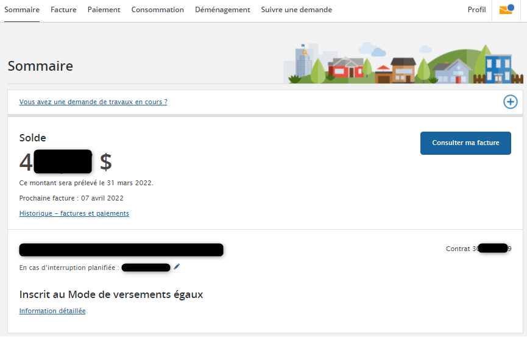
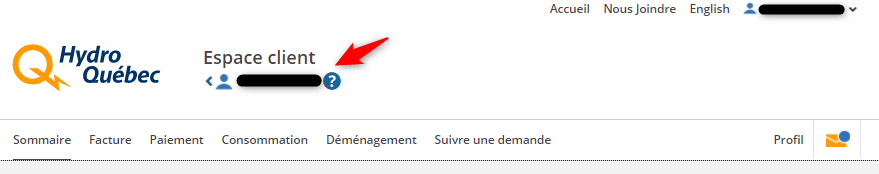
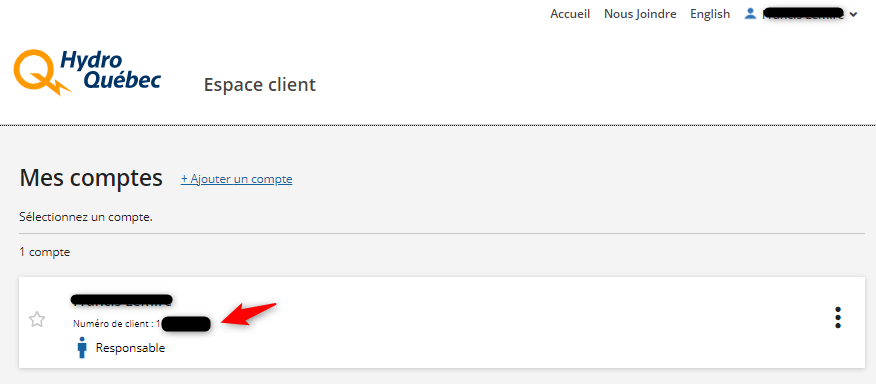
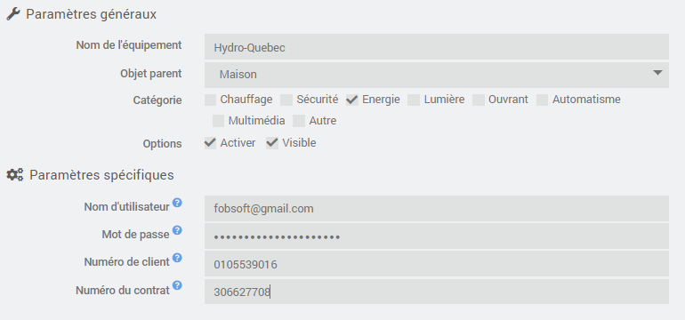
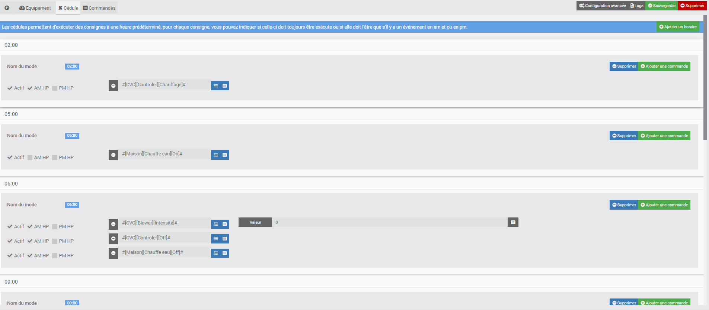

<a href="../../../{{site.baseurl}}/{{page.pluginId}}/{{page.lang}}">{{page.title}}</a>

> Le plugin est encore jeune et peut encore comporter quelques bugs, mais il évolue régulièrement : n’hésitez pas à me contacter à mon courriel personnel, sois le fobsoft@gmail.com avec toutes vos remarques et suggestions.

# Présentation
Plugin permettant de récupérer les informations de consommation électrique et des événements d'Hydro-Québec (wwww.hydroquebec.com), et de créer des crons en fonction des événements

# Installation et Configuration du plugins
Dans la section, "Configuration" se trouve quelques options pour configurer l'affichage des logs du plugin.

Dans la section "Fonctionnalités", vous pouvez constater une cron, elle sert à récupérer vos informations de consommation et les événements à venir.

Une fois le plugin activé, on peut donc passer directement à la création d'un équipement.

# Configuration des équipements
Les équipements sont accessibles à partir du menu Plugins → Energie → Hydro Quebec.

Sur cette page vous retrouvez la liste de vos équipements. Cliquez sur un équipement pour accéder à sa configuration ou sur "Ajouter" pour en créer un nouveau:

## Équipement
* Paramètres généraux
  * Nom de l'équipement : nom de votre équipement.
  * Objet parent : indique l’objet parent auquel appartient l’équipement.
  * Catégorie : indique la oou les catégories auquel l’équipement fait référence.
  * Activer : permet de rendre l’équipement actif.
  * Visible : permet de rendre l’équipement visible sur le dashboard.
* Paramètres spécifiques
  * Nom d'utilisateur : Renseignez votre nom d'utilisateur de votre compte client d'hydro-québec (celui que vous utilisez lorsque vousvous conntez sur le site d'Hydro-Québec)
  * Mot de passe : Renseignez votre mot de passe de votre compte client d'hydro-québec (celui que vous utilisez lorsque vousvous conntez sur le site d'Hydro-Québec)
  * Numéro de client : Renseignez votre numéro de client de votre compte client d'hydro-québec (10 caractères numériques)
  * Numéro du contrat : Renseignez votre numéro de contrat de votre compte client d'hydro-québec (9 caractères numériques)

> Pour connaître votre numéro de contrat, connectez-vous à votre compte d'Hydro-Québec, sous l'onglet Sommaire.

> Pour connaître votre numéro de client, connectez-vous à votre compte d'Hydro-Québec, cliquer ssur votre nom.

Et voici un aperçu

  
## Mode
Les modes sont des consignes prédéterminées qui seront exécutées lors d'un événement d'Hydro-Québec. Comme par exemple le sur-chauffage de pièce avant l'événement et l'arrêt de celui-ci au début de l'événement. Vous disposez d'un mode "Avant l'événement HP" et "Après l'événement HP" où vous pouvez configurer le nombre d'heures de déphasage pour l'exécution de ceux-ci lors de l'événement.

## Commandes
Affiche la liste des commandes créés.

# FAQ
Pour toute question, suggestion ou problème, écrivez-moi au fobsoft@gmail.com 

# Changelog
[Lien vers le changelog](./changelog.md)
