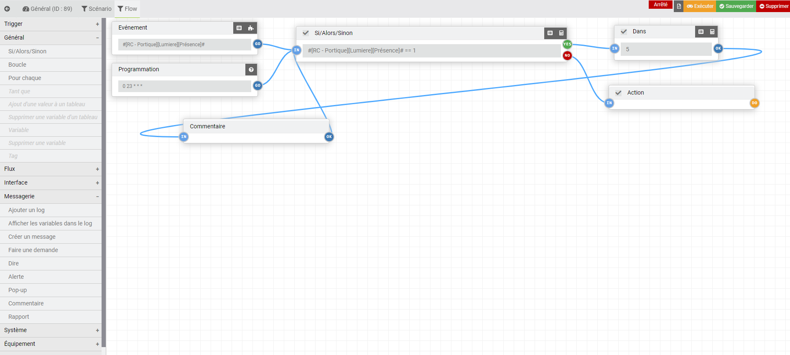

<a href="../../../{{site.baseurl}}/{{page.pluginId}}/{{page.lang}}">{{page.title}}</a>

> Le plugin est encore jeune et peut encore comporter quelques bugs, mais il évolue régulièrement : n’hésitez pas à me contacter à mon courriel personnel, sois le fobsoft@gmail.com avec toutes vos remarques et suggestions.

# Présentation
Plugins pour gérer vos créer/modifier vos scénarios. Utilise le système de scénario existant en ajoutant quelque fonctionnalité.
* Une maintenance par nœud
* Ajout de tag
  * parentLog: Objet parent du déclencheur du scénario, si le nom des objets son remplacer dans la spécification des équipements ex: [#parentLog#][Lumiere][On], le scénario peut etre utilise pour n'importe quel objet.
* Ajout de block
  * foreach: Permet de réaliser une action pour chaque élément d'un tableau.
  * while: Permet de réaliser une action tant que la condition est valide.
* Ajout d'opérateur
  * in_array: Permet de déterminer si une valeur est contenue dans l'array
  * notin_array: Permet de déterminer si une valeur n'est pas contenue dans l'array
* Ajout de commande
  * array_add: Création/ajout d’une valeur à un tableau (n'existe que pendant l'exécution du scénario.)
  * array_remouve: Suppression d’une valeur d’un tableau
  * logVariable: Permet d'afficher dans le log toutes les valeurs associées à l'exécution du scénario (variable, tag, tableau)
  * execGenericType: Permet d'exécuter les commandes des équipements d'un type générique

# Installation et Configuration du plugins
Dans la section, "Configuration" se trouve quelques options pour configurer l'affichage des logs du plugin.
Une fois le plugin activé, on peut donc passer directement à la création et modification de ceux-ci.

# Configuration
Vous pouvez accéder à la fenêtre de maintenance à partir du menu Plugins → Programmation → Scenario Advence.

Sur cette page, vous retrouvez la liste de vos scénarios comme à l'habituelle. Je ne documenterais pas le fonctionnement d'un scénario, puisqu'il y a déjà une documentation dédiée à ceci. Mais voici donc en image ce à quoi cela ressemble.

