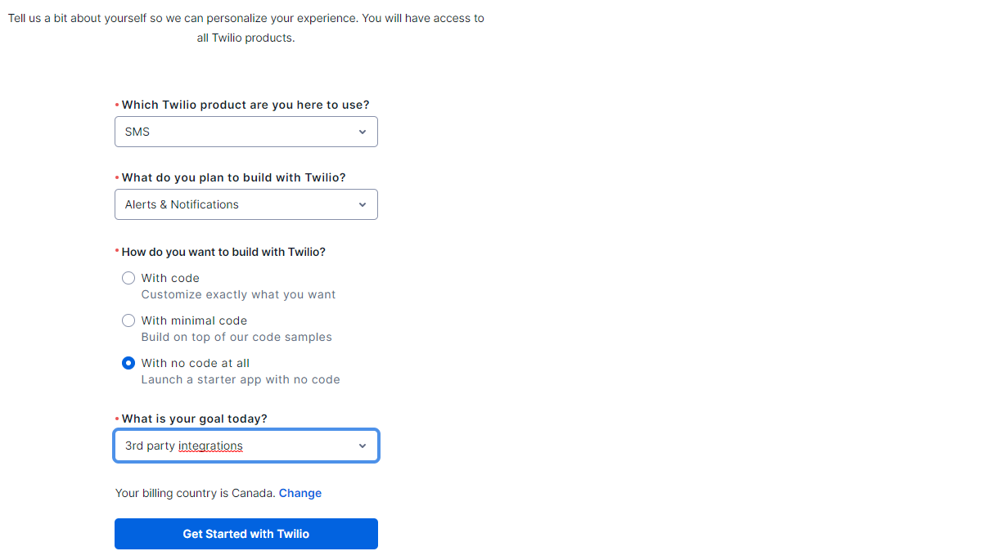
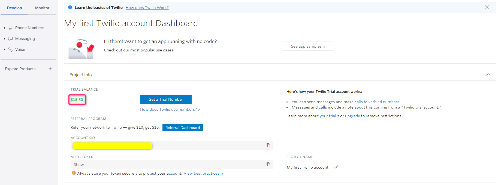
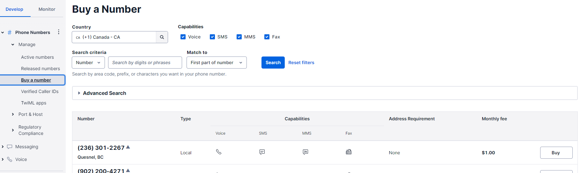
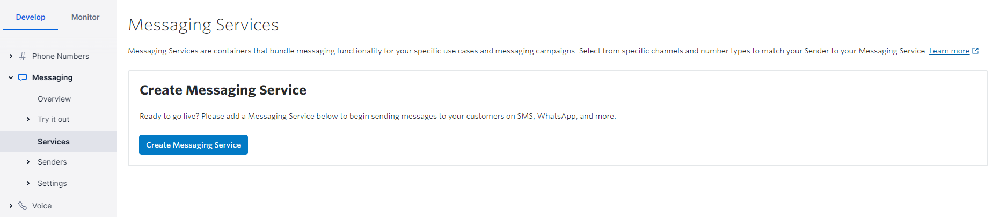
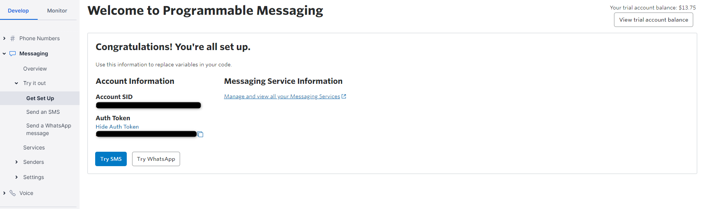
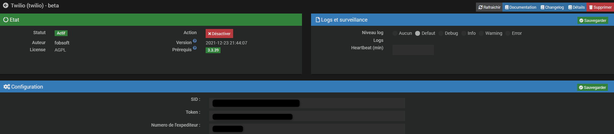

<a href="../../../{{site.baseurl}}/{{page.pluginId}}/{{page.lang}}">Plugin {{page.pluginId}}</a>

# Présentation
Ce plugin permet, via l’API que twilio met à disposition, d'envoyez des SMS à vos expéditeurs, où qu'ils se trouvent, grâce à des expéditeurs mondiaux et à une infrastructure de télécommunications redondante..
 
Twilio est une plateforme qui évolue avec vous, elle relevé les défis de la mise à l'échelle avec des logiciels configurables pour gérer les numéros de téléphone, sélectionner les expéditeurs, respecter les normes, le contenu et les réponses.
Les SMS ne sont que le début. Il est possible de gérer MMS, WhatsApp et bien plus encore ou ajoutez une messagerie multipartite multicanale. 
Lorsque vous êtes prêt à déployer des canaux additionnels, utilisez la même plateforme d'engagement client pour ajouter des appels vocaux, vidéo et des e-mails.

> Le plugin est encore jeune et peut encore comporter quelques bugs mais il évolue régulièrement : n’hésitez pas à me contacter à mon courriel personnel, sois le fobsoft@gmail.com avec toutes vos remarques et suggestions. Pour l'instant il n'est possible que d'envoyer des sms, mais selon les demandes futur j'ajouterais des fonctionnalitées au plugin.

# Installation et Configuration

## Configuration de votre compte twilio pour envoyer des sms
Inscrivez-vous, si ce n'est pas déjà fait au (https://www.twilio.com/try-twilio).

Suite à l'inscription, vous devrez répondre à certaine question, voici mes suggetion de réponse.

Vous serez redirigé ensuite à votre consol, vous pourrez constater alors que vous disposez d'un certain montant pour essayer le service.

Faite l'achat d'un numéro de téléphone

Créez-vous un service de messagerie.

Une fois fais, dirigez-vous ici pour connaître les informations dont vous aurez besoin pour la configuration du plugins

## Configuration du plugins 
Pour fonctionner le plugin a besoin de certaines informations, donc une fois le plugin installé, vous devez aller dans la page "Configuration" du plugin et renseigner votre identifiant (SID) votre token ainsi que le numéro de l'expéditeur

Vous pouvez ensuite ajouter un équipement dans le menu habituel sous "Communication".
Vous pouvez ensuite sous l'onglet "Commandes" ajouter une commande, donner un nom à celle-ci et un numéro de destination.
Ensuite il vous suffit d'effectuer un test pour vous assurer le bon fonctionnement.

# FAQ
Pour toute question ou problème, écrivez-moi au fobsoft@gmail.com 

# Changelog
[Lien vers le changelog](./changelog.md)
