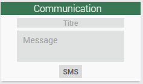

<a href="../../../{{site.baseurl}}/{{page.pluginId}}/{{page.lang}}">Plugin {{page.pluginId}}</a>

# Présentation
Ce plugin permet, via l’API que twilio met à disposition, d'envoyez des SMS à vos expéditeurs, où qu'ils se trouvent, grâce à des expéditeurs mondiaux et à une infrastructure de télécommunications redondante..
 
Twilio est une plateforme qui évolue avec vous, elle relevé les défis de la mise à l'échelle avec des logiciels configurables pour gérer les numéros de téléphone, sélectionner les expéditeurs, respecter les normes, le contenu et les réponses.
Les SMS ne sont que le début. Il est possible de gérer MMS, WhatsApp et bien plus encore ou ajoutez une messagerie multipartite multicanale. 
Lorsque vous êtes prêt à déployer des canaux additionnels, utilisez la même plateforme d'engagement client pour ajouter des appels vocaux, vidéo et des e-mails.

> Le plugin est encore jeune et peut encore comporter quelques bugs mais il évolue régulièrement : n’hésitez pas à me contacter à mon courriel personnel, sois le fobsoft@gmail.com avec toutes vos remarques et suggestions. Pour l'instant il n'est possible que d'envoyer des sms, mais selon les demandes futur j'ajouterais des fonctionnalitées au plugin.

> Attention, les frais chargé par Twilio peuvent varier d'une région à une autre.

# Installation et Configuration

## Configuration de votre compte twilio pour envoyer des sms
* Inscrivez-vous, si ce n'est pas déjà fait au (https://www.twilio.com/try-twilio).

* Suite à l'inscription, vous devrez répondre à certaine question, voici mes suggetion de réponse. 

* Vous serez redirigé ensuite à votre consol, vous pourrez constater alors que vous disposez d'un certain montant pour essayer le service. 

* Faite l'achat d'un numéro de téléphone. 

* Créez-vous un service de messagerie. 

* Une fois fais, dirigez-vous ici pour connaître les informations dont vous aurez besoin pour la configuration du plugins. 

* Si vous avec des problèmes de permission pour faire l'envoi de message dirigez-vous ici pour ajouter des permissions à votre service

## Configuration du plugins 
Pour fonctionner le plugin a besoin de certaines informations, donc une fois le plugin installé, vous devez aller dans la page "Configuration" du plugin et renseigner votre identifiant (SID) votre token ainsi que le numéro de l'expéditeur. 

# Configuration des équipements
Les équipements sont accessibles à partir du menu Plugins → Communication → Twilio.

Sur cette page vous retrouvez la liste de vos équipements. Cliquez sur un équipement pour accéder à sa configuration ou sur Ajouter pour en créer un nouveau:

## Equipement

*  Nom : nom de votre équipement.
*  Objet parent : indique l’objet parent auquel appartient l’équipement.
*  Activer : permet de rendre l’équipement actif.
*  Visible : permet de rendre l’équipement visible sur le dashboard.

## Commandes
Sous cet onglet, vous pouvez ajouter une commande, donner un nom à celle-ci et un numéro de destination comme par exemple (+33123456789), celle-ci vous permettra à son appel d'envoyer un message à ce destinataire.
Ensuite, il vous suffit d'effectuer un test pour vous assurer le bon fonctionnement.

# Dashbord
Et voici un aperçu de l'équipement sur le dashbord

# FAQ
Pour toute question ou problème, écrivez-moi au fobsoft@gmail.com 

# Changelog
[Lien vers le changelog](./changelog.md)
